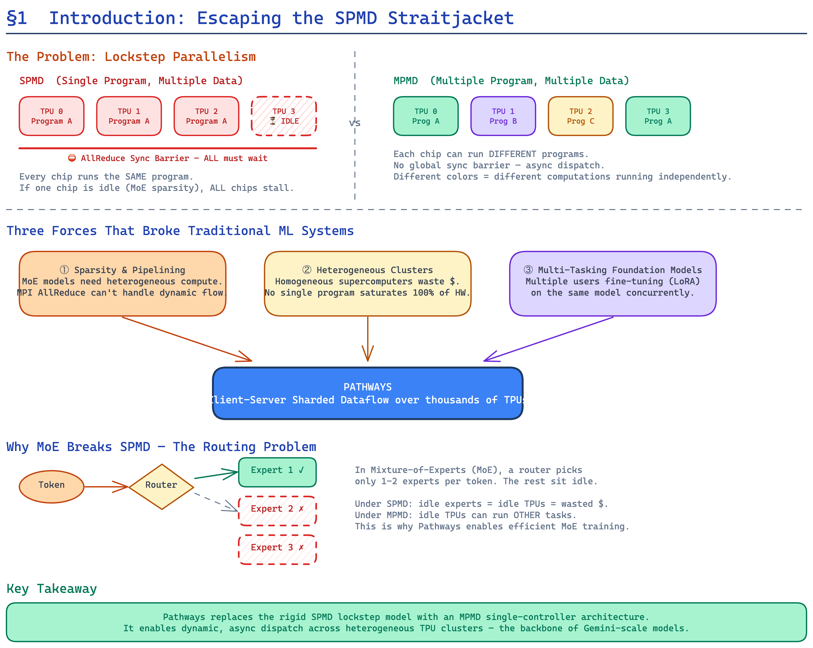
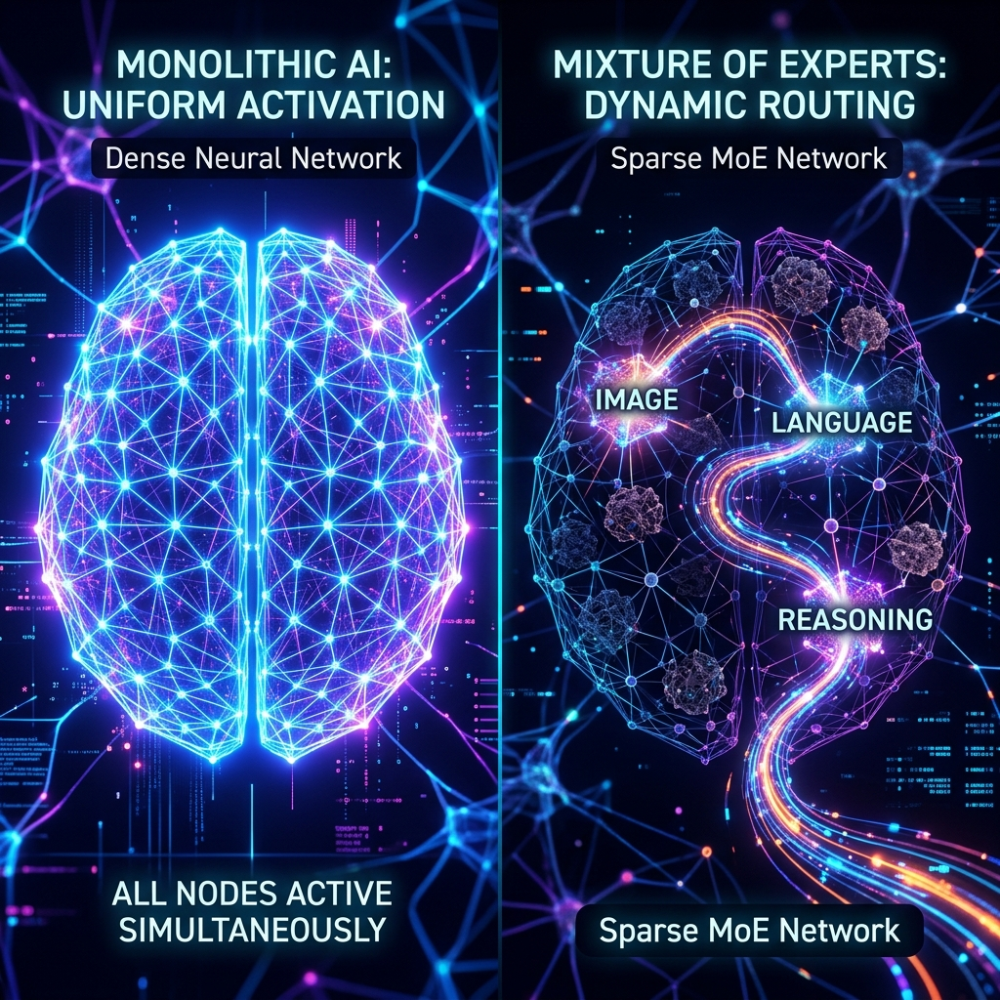
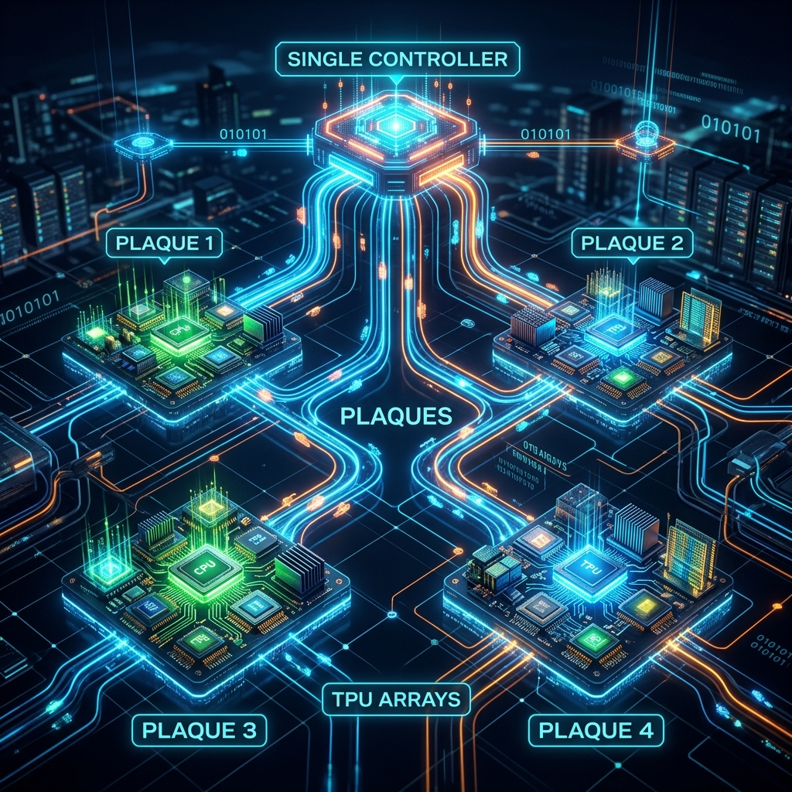

# Part 1: Introduction — Escaping the SPMD Straitjacket

> *"Systems become over-specialized to current workloads and fail to anticipate future needs."*
> — Pathways authors (Barham et al., 2022)

---

## The Problem: Why Did We Need Pathways?

Deep learning's explosive growth over the last decade—from AlexNet's ImageNet breakthrough (2012) to GPT-3's few-shot language mastery (2020)—was built on a co-evolutionary triad: **models**, **accelerator hardware**, and **the software systems that tie them together**. Each generation of models demanded new hardware, and each hardware generation demanded new systems.

But by 2021, this co-evolution had created a dangerous trap. The software systems that orchestrated distributed training—the invisible plumbing beneath every LLM—had become **over-specialized to a single paradigm**: SPMD.

---

## What is SPMD, and Why Was It a Straitjacket?

**SPMD (Single Program, Multiple Data)** is the programming model inherited from the High-Performance Computing (HPC) world via MPI (Message Passing Interface). In SPMD, every accelerator in the cluster runs the **exact same compiled program** on different slices of the training data simultaneously. Communication between accelerators is restricted to a handful of well-defined **collectives** like `AllReduce`—operations where every chip must participate at the same time.

For **dense** models (where every parameter is updated on every step), SPMD is remarkably efficient. The pattern is simple:

1. Every chip loads the same model weights.
2. Each chip processes a different mini-batch of data.
3. All chips synchronize gradients via `AllReduce`.
4. Repeat.

Because every chip executes the same code, coordination is implicit—there's nothing to schedule, no control flow to manage. The system is trivially correct.

**But three forces were breaking SPMD apart:**

### 1. The Rise of Computational Sparsity and Pipelining

Models like **Mixture of Experts (MoE)** (Shazeer et al., 2017) exploit **computational sparsity**: instead of updating every parameter for every example, they dynamically **route** each input to a small subset of "expert" sub-networks. If a user asks a math question, the "math expert" fires; if they ask for poetry, the "language expert" fires. The rest of the model stays dormant.

This is fundamentally **heterogeneous computation**—different accelerators need to run different code at different times based on the actual data flowing through the system. SPMD, where every chip must execute the same program in lockstep, is a catastrophically bad fit.

Similarly, **pipeline parallelism** (used to train models too large to fit on a single chip) splits the model into sequential stages. Stage 1 runs the embedding layer, Stage 2 runs transformer blocks 1–4, Stage 3 runs blocks 5–8, etc. Each stage is a fundamentally different computation—again breaking the "single program" assumption.

Researchers had built ingenious workarounds (GPipe, Megatron-LM, DeepSpeed) to shoehorn pipelining into SPMD frameworks, but these hacks were brittle, required massive engineering effort, and left researchers unable to explore truly novel sparse architectures.

### 2. The Heterogeneity of Modern Clusters

Providing exclusive access to large "islands" of homogeneous accelerators connected over high-bandwidth interconnects is **expensive and wasteful**. A single user's program must try to keep *all* accelerators continuously busy—and for many workloads, that's impossible. If a model only needs 256 TPUs but the smallest available island has 1,024, three-quarters of the hardware sits idle.

This was driving researchers toward **MPMD (Multiple Program, Multiple Data)** computations that map sub-parts of the overall computation to a collection of more readily available **smaller islands** of accelerators. But existing SPMD frameworks had no mechanism to express or execute such computations.

### 3. The Foundation Model Revolution

By 2021, the field was standardizing on **foundation models**—massive pre-trained models (like BERT, GPT, T5) that are fine-tuned for many downstream tasks. This created an obvious opportunity: if 50 researchers all need the same pre-trained model weights, why should each one load a separate copy onto a separate island of TPUs? Why can't they **share** the same weights on the same hardware, each fine-tuning different layers concurrently?

This requires a system that can **multiplex** multiple programs on shared hardware at millisecond timescales—something SPMD's "exclusive ownership" model fundamentally cannot support.

---

## Pathways: The Paradigm Shift

Pathways solved all three problems simultaneously by making a radical architectural choice: **abandoning the multi-controller model in favor of a single-controller, client-server architecture**.

### Multi-Controller (JAX/PyTorch today)

In a multi-controller system, an identical copy of the user's Python script runs on every host machine. Each copy dispatches work to its local accelerator via fast PCIe links. This gives near-zero dispatch latency, but assumes:

- **Exclusive hardware ownership** — the user's program takes full control of its accelerators.
- **Homogeneous computation** — every copy of the script does the same thing.
- **Collectives-only communication** — all cross-device communication uses pre-defined operations over dedicated interconnects (ICI, NVLink).

### Single-Controller (Pathways)

In Pathways, **one centralized client process** expresses the complete computation and hands it off to a distributed runtime. This immediately unlocks:

- **Dynamic dispatch** — different sub-computations can be sent to different groups of accelerators.
- **Resource virtualization** — the system can assign, reclaim, and reassign hardware transparently.
- **Multi-tenancy** — multiple programs from different users can time-multiplex the same accelerators.
- **MPMD execution** — different parts of the computation graph can run different compiled functions on different hardware islands.

The critical engineering challenge was to do all of this **without sacrificing the raw performance** of multi-controller systems. This is the central hypothesis of the Pathways paper, and—as the evaluation demonstrates—they proved it true.

---

## The Pathways System in One Sentence

> Pathways is a sharded dataflow system of asynchronous operators that consume and produce futures, efficiently gang-scheduling heterogeneous parallel computations on thousands of accelerators while coordinating data transfers over their dedicated interconnects.

Every word in that sentence is load-bearing. Over the next six posts, we will unpack each one:

| Concept | Blog Post |
|---------|-----------|
| Why single-controller over multi-controller? | [Part 2: Design Motivation](02_design_motivation.md) |
| How does the user interact with Pathways? | [Part 3: Programming Model](03_programming_model.md) |
| How does the system manage hardware? | [Part 4a: Resource Manager](04a_system_architecture_resource_manager.md) |
| How does the client avoid becoming a bottleneck? | [Part 4b: Client Architecture](04b_system_architecture_client.md) |
| How is execution coordinated across thousands of chips? | [Part 4c: Plaque Coordination](04c_system_architecture_coordination.md) |
| How does gang-scheduling work at millisecond scale? | [Part 4d: Gang Scheduling](04d_system_architecture_gang_scheduling.md) |
| How does async dispatch hide latency? | [Part 4e: Asynchronous Dispatch](04e_system_architecture_asynchronous_dispatch.md) |
| How is distributed data managed efficiently? | [Part 4f: Data Management](04f_system_architecture_data_management.md) |
| Does it actually work? The numbers. | [Part 5: Evaluation](05_evaluation.md) |
| What comes next? | [Part 6: Future Directions](06_related_work_and_future_directions.md) |
| Hardware deep-dive: ICI vs DCN, TPU vs GPU | [Part 7: Appendices](07_appendices.md) |

---

*Next up: [Part 2 — The Multi-Controller vs. Single-Controller Dilemma →](02_design_motivation.md)*
