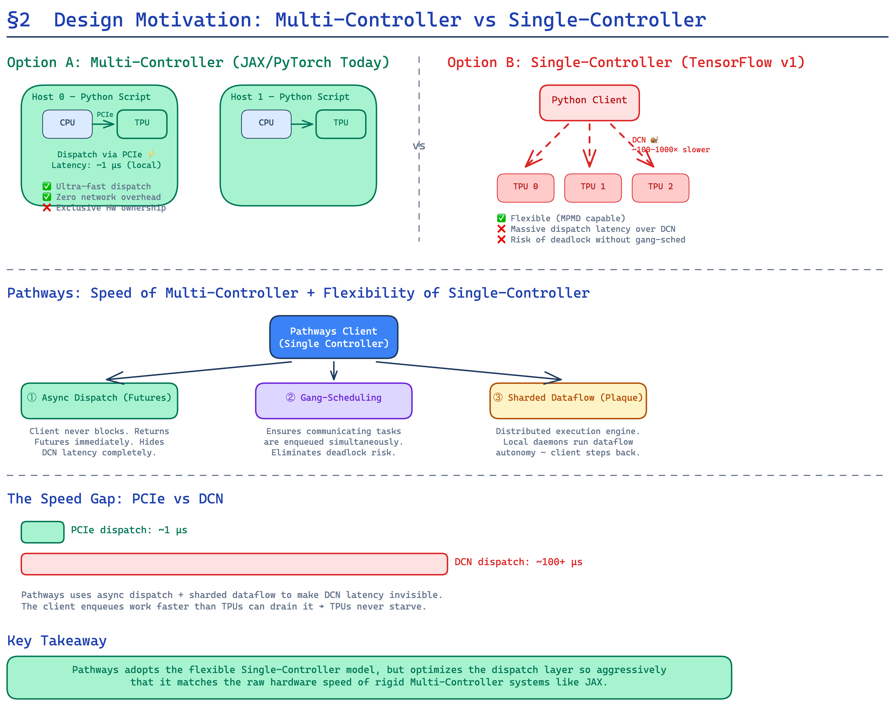
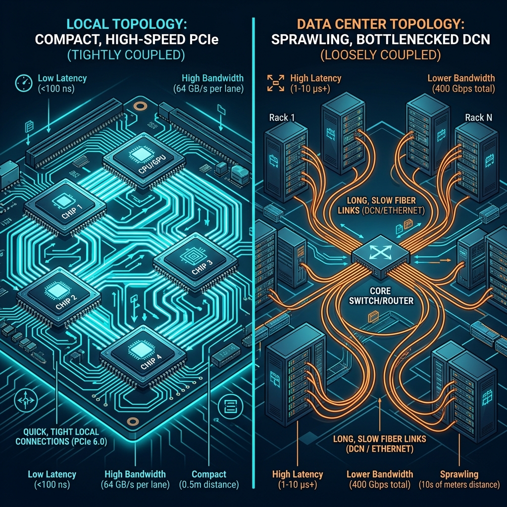

# Part 2: Design Motivation — The Fast vs. Flexible Tradeoff

> "A single-controller architecture... provides a very general distributed dataflow model... however, implementation challenges have historically resulted in poor performance at scale."
> — §2, Pathways paper

---

## The Brutal Engineering Tradeoff

When building a distributed ML system, engineers have historically faced a brutal ultimatum: **fast or flexible — pick one.** This section of the paper dissects *why* that tradeoff existed, *how* it constrained ML research, and *what* architectural choices Pathways made to resolve it.

---

## Option A: The Multi-Controller Architecture

> **Examples:** JAX, PyTorch DDP, MPI-based systems

In a multi-controller system, **the same client executable runs directly on every host** in the cluster. Each host takes **exclusive ownership** of its locally attached accelerators for the entire duration of the program.

### Why It's Fast

The key advantage is **dispatch latency**. When a multi-controller client wants to launch a computation on its local TPU/GPU, the communication path is:

```
Python script → Host CPU → PCIe link → Accelerator
```

PCIe is fast—the dispatch involves communication **only over local, fast interconnects**. Each host independently enqueues work to its own accelerators without any coordination from a central authority. All cross-device communication (gradient synchronization, etc.) happens through **collectives** (`AllReduce`, `AllGather`) over dedicated interconnects like **ICI** (TPU) or **NVLink** (GPU), entirely bypassing host memory.

### Why It's Inflexible

This architecture **breaks down** for modern ML workloads:

1. **No heterogeneous computation.** Since every host runs the same program, you cannot easily express computations where different accelerators do different things (pipeline stages, MoE expert routing).

2. **Exclusive ownership.** The multi-controller approach "shifts the responsibility of ensuring high utilization of the expensive accelerators on to the user." If your model doesn't perfectly fill all available hardware, those resources are wasted. There's no system-level mechanism for multiplexing.

3. **No coordination primitives.** Any communication beyond standard collectives requires users to implement their own coordination—an error-prone exercise in distributed systems engineering.

4. **No resource virtualization.** Hardware is tied directly to the program. If a chip fails mid-training, recovery requires manual intervention. Features like suspend/resume, migration, and multi-tenancy are "complicated" to implement.



---

## Option B: The Single-Controller Architecture (TensorFlow v1)

> **Example:** TensorFlow v1's distributed runtime

TensorFlow v1 took the opposite approach: a **single Python client** builds a computation graph and sends it to a coordinator runtime, which partitions the graph into subgraphs for each worker and delegates execution.

### Why It's Flexible

The single-controller design offers a "very general distributed dataflow model, including optimized in-graph control flow." You can express arbitrary computation patterns: pipelining, conditional execution, dynamic routing—anything that can be represented as a dataflow graph.

### Why It's Slow

Three critical implementation challenges killed TF v1's performance at scale:

**1. Dispatch Latency Over DCN**

While multi-controller systems dispatch over fast PCIe, single-controller systems are fundamentally "farther away." The client must send commands over the **Datacenter Network (DCN)**, which is typically **an order of magnitude slower** than PCIe:

```
┌─────────────────────────────────────────────────────────┐
│  Multi-Controller (JAX):                                │
│  Client → PCIe → Accelerator   (~microseconds)         │
│                                                         │
│  Single-Controller (TF v1):                             │
│  Client → DCN → Worker Host → PCIe → Accelerator       │
│  (~hundreds of microseconds to milliseconds)            │
└─────────────────────────────────────────────────────────┘
```

For programs involving frequent cross-host transfers (e.g., pipelined models with many stages), these dispatch latencies **accumulate**, leading to devastating accelerator idle time.

**2. No Gang-Scheduling Across Programs**

TPUs are **single-threaded** and run **non-preemptible kernels**. If communicating computations (e.g., two sides of an `AllReduce`) are not enqueued in a **consistent order**, the system will **deadlock**. This is not a hypothetical risk—it's a mathematical certainty for any SPMD computation on shared accelerators.

TF v1 users could *inefficiently* enforce ordering within a single program using control edges, but there was **no centralized scheduler** to ensure consistent ordering **between** computations from different programs. Multi-tenancy on shared accelerators was essentially impossible.

**3. Fully Materialized Sharded Graphs**

TF v1 materialized the **complete** sharded computation graph. For a computation with `M`-way sharding feeding into an `N`-way sharded computation, the graph required `M + N` nodes and **`M × N` edges**. At the scale of thousands of shards, this produced **millions of graph edges**, creating devastating overhead in both graph serialization and execution.

---

## Pathways: The Best of Both Worlds

Pathways resolves these three challenges while retaining the single-controller's flexibility:

| Challenge | TF v1 Failure | Pathways Solution |
|-----------|---------------|-------------------|
| Dispatch latency | DCN too slow | **Asynchronous dispatch** — the client fires futures and moves on without waiting |
| Gang scheduling | No centralized scheduler | **Per-island centralized schedulers** with FIFO ordering (extensible to more sophisticated policies) |
| Graph explosion | `M × N` edges | **Sharded dataflow** — compact representation with single nodes for sharded computations; `N` data tuples flow along edges regardless of shard count |

### The Key Architectural Innovations

1. **Asynchronous dispatch** to mask DCN latency and match multi-controller performance (detailed in [Part 4e](04e_system_architecture_asynchronous_dispatch.md)).

2. **Centralized resource management and scheduling** with first-class support for gangs of SPMD accelerator computations (detailed in [Part 4a](04a_system_architecture_resource_manager.md) and [Part 4d](04d_system_architecture_gang_scheduling.md)).

3. **A sharded dataflow system** (Plaque) for efficient coordination that keeps graph representations compact regardless of shard count (detailed in [Part 4c](04c_system_architecture_coordination.md)).

These aren't incremental improvements—they represent a **fundamental rethinking** of how a single-controller system can be engineered to match bare-metal multi-controller performance while gaining the flexibility to express the computation patterns required by next-generation ML models.

---

## Why This Matters in 2024

The design tradeoffs described in this section are not merely historical. Today:

- **Gemini** is natively multi-modal, processing text, images, audio, and video simultaneously—a fundamentally MPMD workload.
- **Mixtral** and other open MoE models require dynamic, data-dependent routing of tokens to experts.
- **LoRA fine-tuning** allows dozens of researchers to concurrently adapt the same base model—demanding multi-tenancy at millisecond granularity.

All of these workloads are impossible (or agonizingly inefficient) on pure SPMD multi-controller systems. The architectural decisions made in Pathways §2 directly enabled the infrastructure behind Google's most advanced models.



---

*Next up: [Part 3 — The Programming Model: Write Python, Scale to Thousands of TPUs →](03_programming_model.md)*
