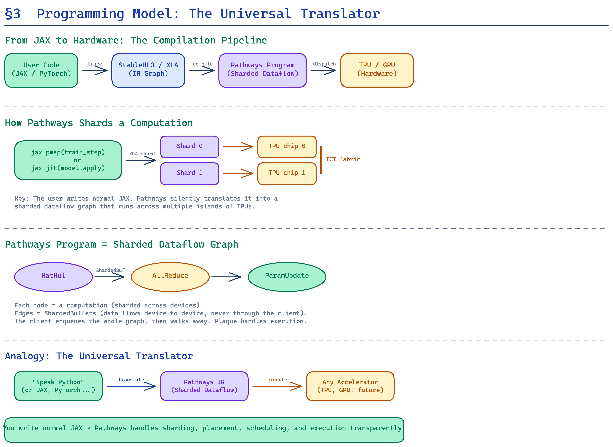

# Part 3: Programming Model — Write Python, Scale to Thousands of TPUs

> *"A user program runs the client library within a single Python process, and uses the familiar JAX API to distribute computations."*
> — §3, Pathways paper

---

## The Central Challenge: Abstraction Without Sacrifice

A distributed ML system is only as good as the API it presents to researchers. If the programming model is too low-level (raw MPI calls, manual device placement), researchers spend more time fighting the system than doing science. If it's too abstract (hiding device topology, data movement), performance suffers because the system can't exploit data locality or hardware-specific optimizations.

Pathways threads this needle by building on **JAX's existing programming model** and extending it with a **resource manager** that decouples logical computation from physical hardware. The user writes standard JAX/Python code. Pathways handles everything else.

---

## JAX in 60 Seconds

For readers unfamiliar with JAX, here's the essential mental model. JAX (Bradbury et al., 2018) is a Python framework for composable numerical computing with three key primitives:

1. **`jax.jit`** — Traces a Python function and compiles it to an XLA (Accelerated Linear Algebra) program that runs natively on accelerators. The compiled program is a **static computation graph**: all shapes and types must be known at trace time.

2. **`jax.pmap` / `jax.pjit`** — Distributes a jit-compiled function across multiple devices using SPMD parallelism. The user annotates tensor axes with **sharding constraints** (e.g., "shard the batch dimension across 8 devices"), and the XLA compiler inserts the necessary collective operations.

3. **Functional transformations** — `jax.grad`, `jax.vmap`, etc., compose with `jit` and `pmap`. A user can write a simple single-device loss function and mechanically derive the distributed, batched, gradient-computing version.

```python
# Single-device scalar loss function
def loss_fn(params, batch):
    logits = model(params, batch['input'])
    return cross_entropy(logits, batch['label'])

# Automatic gradient computation + compilation + distribution
@jax.pjit
def train_step(params, batch):
    grads = jax.grad(loss_fn)(params, batch)
    return params - 0.001 * grads
```

The key insight from JAX's design is that **compiled functions** (the output of `jax.jit`) are the fundamental unit of accelerator work. They have statically known input/output shapes, can be serialized into XLA HLO (High Level Optimizer) programs, and are executable on any compatible accelerator without modification.



---

## From JAX to Pathways: What Changes

When running under Pathways, the user's JAX code is **unchanged**—but the underlying execution model shifts fundamentally:

### Multi-Controller JAX (Standard)

```
User Python → jit trace → XLA compile → dispatch to local accelerators
                                          (via PCIe, same host)
```

Each invocation of `jax.pjit` exclusively owns the accelerators it was launched on. The user must manually request the right number of hosts when launching the job. If a host fails, the entire job crashes.

### Single-Controller Pathways

```
User Python → jit trace → XLA compile → submit to Pathways runtime
                                          (via RPC, any host)
```

The Pathways runtime then:
1. **Breaks** the compiled function into per-device **shards** (one per participating accelerator).
2. **Assigns** shards to physical devices via the **Resource Manager** (see [Part 4a](04a_system_architecture_resource_manager.md)).
3. **Enqueues** shards for execution via the distributed coordination layer (**Plaque**, see [Part 4c](04c_system_architecture_coordination.md)).
4. **Returns futures** to the client so execution can overlap with subsequent dispatch work.

### Virtual Devices and Resource Abstraction

The most impactful user-facing change is that Pathways introduces **virtual devices**. Instead of programming against `jax.devices()` (which returns physical TPU/GPU handles), the user requests a **virtual device mesh** from the resource manager:

```python
# Old (multi-controller JAX):
devices = jax.devices()  # Returns physical TPUs on this host

# New (Pathways):
virtual_mesh = pathways.resource_manager.request(
    device_type="TPUv4",
    topology=[4, 8]  # 4×8 grid of virtual devices
)
```

The resource manager maps this virtual mesh to physical hardware transparently. This means:

- **Elastic scaling:** The same program can run on 32, 256, or 2048 TPUs—just change the mesh request.
- **Migration:** If a physical device fails, the resource manager can remap the virtual mesh to healthy hardware.
- **Multi-tenancy:** Two programs can share the same physical TPU island, each seeing its own virtual mesh.

---

## The Compiled Function Abstraction

The paper introduces a precise characterization of the computational units that flow through the system (Appendix B):

> A **compiled function** is a sub-computation whose:
> 1. Input and output **types and shapes** are known before input data is computed.
> 2. Loop bounds are either **static** or have a maximum trip count with early termination.
> 3. Conditionals are **functional** — both branches produce the same output type, and resources are allocated for the worst case.

These constraints exist because of the co-evolution between ML frameworks and accelerator hardware (detailed in [Part 7](07_appendices.md)). They enable:

- **Static memory allocation** — The system knows exactly how much HBM each function needs, enabling pre-allocation without runtime fragmentation.
- **Asynchronous enqueuing** — Because resource needs are known in advance, the system can enqueue compiled functions *before* their input data is ready, building up a pipeline of work on the accelerator.
- **Compiler optimizations** — XLA can perform layout assignment, operator fusion, and automatic rematerialization because the entire function is visible at compile time.

---

## Expressing MPMD Computations

While standard JAX's `pjit` is designed for SPMD, Pathways extends the programming model to support **MPMD (Multiple Program, Multiple Data)**. The user can express computations where different compiled functions run on different hardware:

```python
# Conceptual MPMD workflow in Pathways
# Stage 1: embedding lookup on island A
embedding = pathways.run(embed_fn, inputs, devices=island_a)

# Stage 2: transformer forward on island B
logits = pathways.run(transformer_fn, embedding, devices=island_b)

# Stage 3: loss & backward on island A
loss = pathways.run(loss_fn, logits, devices=island_a)
```

Each `run` call creates a node in the Pathways computation graph. The system handles:
- **Data transfers** between islands (embedding → transformer, logits → loss).
- **Gang-scheduling** to ensure all devices in an island are synchronized.
- **Buffer management** to avoid unnecessary copies or memory waste.

This is the programming model that enables **pipeline parallelism** and **MoE training** at thousand-chip scale.

---

## Input Data Processing

An overlooked but critical detail: JAX has deliberately **avoided re-implementing data loading pipelines** (Appendix C). In practice, `tensorflow/datasets` is commonly used for JAX input processing. Pathways leverages this by:

1. Instantiating a **CPU-based TensorFlow executor** on each Pathways worker host.
2. Allowing user programs to **serialize input processing** into a TensorFlow graph.
3. Distributing data loading across the workers, so that input pipelines can saturate accelerators even at massive scale.

---

## The Programming Model in Context

| Feature | Multi-Controller JAX | Pathways |
|---------|---------------------|----------|
| Client model | Many (one per host) | Single Python process |
| Device access | Physical, exclusive | Virtual, shareable |
| Parallelism | SPMD only | SPMD + MPMD |
| Failure recovery | Job restart | Transparent remapping |
| Code changes | N/A | ~Zero (same JAX API) |

The genius of the Pathways programming model is that it achieves the generality of TensorFlow v1's distributed dataflow model—arbitrary graph topologies, heterogeneous computations, dynamic control flow—while maintaining the ergonomics of JAX's simple functional API. The user writes the same Python code they've always written. The system handles the rest.

---

*Next up: [Part 4a — The Resource Manager: How Pathways Wrangles Thousands of Accelerators →](04a_system_architecture_resource_manager.md)*
