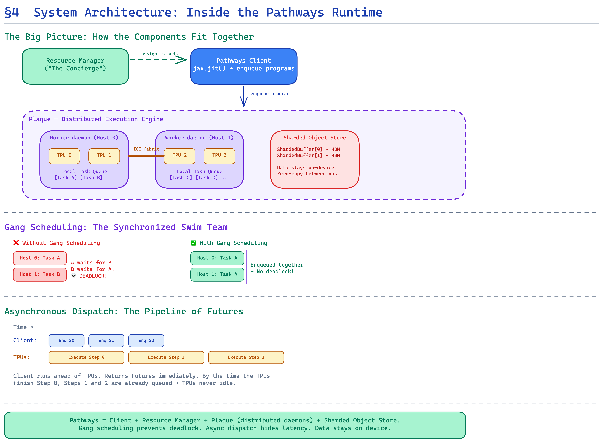

# Part 4a: System Architecture — The Resource Manager

> *"The Pathways resource manager maintains a global view of the state of the system's accelerator resources."*
> — §4.1, Pathways paper

---

## Why Resource Management Is Non-Trivial

In a multi-controller system, resource management is trivially simple: each host owns its accelerators. Period. There's nothing to negotiate, no sharing, no virtualization.

But Pathways' single-controller architecture—where a central client dispatches work across thousands of accelerators owned by many hosts—demands a **global resource manager** that can:

1. Track the state of every accelerator in the cluster.
2. Map logical (virtual) devices to physical hardware.
3. Allocate contiguous groups of devices with the right **network topology**.
4. Support **multi-tenancy** at millisecond timescales.
5. Handle failures, migrations, and elastic scaling.

---

## The Architecture

The Pathways resource manager runs as a **centralized service** within the Pathways runtime. It maintains a global view of:

- **Physical device topology** — Which TPU chips exist, how they're connected (ICI mesh and DCN), and which host machines they're attached to.
- **Virtual device mappings** — Which virtual devices (as seen by user programs) map to which physical devices.
- **Allocation state** — Which devices are currently in use, by which programs, and when they'll be released.

### Virtual vs. Physical Devices

This is the central abstraction. The resource manager presents users with **virtual devices** that behave like physical devices but are:

- **Dynamically assignable** — The same virtual device can map to different physical hardware across runs, or even mid-run.
- **Topology-aware** — Virtual device meshes preserve the logical connectivity expected by the computation (e.g., a 4×8 mesh of virtual TPUs maps to a 4×8 region of the physical ICI mesh).
- **Sharable** — Multiple virtual device meshes from different programs can map to the same physical hardware, enabling multi-tenancy.

```
┌─────────────────────────────────────────────────────────┐
│                   User Program A                        │
│              Virtual Mesh: 2×4 TPUv4                    │
│         [v0] [v1] [v2] [v3]                            │
│         [v4] [v5] [v6] [v7]                            │
└──────────────────┬──────────────────────────────────────┘
                   │  Resource Manager mapping
                   ▼
┌─────────────────────────────────────────────────────────┐
│             Physical TPU Pod (2048 chips)                │
│  ┌──────────────────────────────────────┐               │
│  │  [p0] [p1] [p2] [p3] ...           │               │
│  │  [p4] [p5] [p6] [p7] ...  ← Program A mapped here  │
│  │  [p8] [p9] ...                      │               │
│  │  ...                                │               │
│  └──────────────────────────────────────┘               │
└─────────────────────────────────────────────────────────┘
```



---

## Topology-Aware Allocation

This is where the resource manager earns its complexity budget. TPU pods are not flat pools of interchangeable chips—they are physically arranged in **2D or 3D mesh topologies** with dedicated **Inter-Chip Interconnect (ICI)** links. The bandwidth and latency between any two chips depends on their position in the mesh.

When a user requests a virtual device mesh, the resource manager must find a **contiguous region** of the physical mesh that:

1. **Matches the requested topology** (e.g., a 4×4×2 slice of TPUv4).
2. **Minimizes cross-region communication** by placing all chips on the same ICI mesh when possible.
3. **Avoids fragmentation** that would leave small, unusable islands of free chips scattered across the pod.

This is essentially a **multi-dimensional bin-packing problem**, and it's NP-hard in the general case. The paper describes using heuristics and policies that trade off allocation speed for placement quality.

---

## The Allocation Flow

When a client requests accelerator resources, the following happens:

```
1. Client → Resource Manager: "I need a 4×8 virtual mesh of TPUv4s"
2. Resource Manager:
   a. Checks available capacity across all connected TPU pods
   b. Finds a contiguous 4×8 region in the physical ICI mesh
   c. Creates virtual device handles
   d. Returns virtual device mesh to client
3. Client → Pathways Runtime: "Execute this computation on virtual mesh M"
4. Runtime:
   a. Resolves virtual → physical mapping
   b. Dispatches shards to physical devices
   c. Sets up data transfer channels between physical devices
```

### Multi-Island Allocation

For computations that span multiple TPU **islands** (connected via DCN rather than ICI), the resource manager coordinates allocation across islands:

- Each island has 512–1024+ TPU chips connected via high-bandwidth ICI.
- Islands are connected via **Datacenter Network (DCN)**, which is lower bandwidth but higher capacity.
- The resource manager can allocate virtual meshes that **span multiple islands**, transparently handling the different communication characteristics.

This is the mechanism that enabled the paper's headline result: training a **64B-parameter Transformer** data-parallel over **two islands of 512 TPUs each** (1,024 TPUs total), with cross-island gradient transfers via DCN achieving **97.2% throughput** compared to a single-island SPMD baseline (§5.3, Figure 12).

---

## Multi-Tenancy Support

The resource manager also enables **time-multiplexing** of accelerators. Multiple programs can share the same physical devices:

1. **Program A** is allocated virtual devices that map to physical chips 0–7 from time 0–10ms.
2. **Program B** is allocated the **same** physical chips from time 10–20ms.

This is critically important because many ML workloads have **bursty** computation patterns:
- An MoE model only activates 2 out of 128 experts per token—leaving 126 experts' worth of hardware **idle** in an exclusive-ownership model.
- Fine-tuning workloads often have short bursts of gradient computation followed by long pauses waiting for evaluation.

With the resource manager's multi-tenancy support, the Pathways **gang-scheduler** (see [Part 4d](04d_system_architecture_gang_scheduling.md)) can interleave programs at millisecond timescales. The paper demonstrates that with 16 concurrent clients submitting programs to the same devices, individual computations of just 0.33ms are enough to achieve **~100% device utilization** (§5.2, Figure 8).

---

## Failure Handling and Elasticity

Because the resource manager maintains a **virtual → physical mapping**, it can respond to hardware failures by:

1. Detecting the failure (e.g., a TPU chip becomes unresponsive).
2. **Remapping** the affected virtual device to a healthy physical device.
3. Notifying the runtime to redirect future dispatches.

This is fundamentally impossible in multi-controller systems, where the user's program is directly bound to physical hardware. In Pathways, recovery is **transparent to the user code**.

---

## Key Design Decisions

| Decision | Rationale |
|----------|-----------|
| Centralized resource manager | Global view enables optimal placement and multi-tenancy |
| Virtual device abstraction | Decouples user code from physical hardware topology |
| Topology-aware allocation | Preserves ICI locality for communication-heavy workloads |
| Per-island scheduling | Avoids single-point bottleneck while maintaining gang-scheduling correctness |

The resource manager is the **foundation** of everything Pathways does. Without it, there's no multi-tenancy, no MPMD, no failure recovery, no elasticity. It is the single most important difference between a multi-controller system and Pathways.

---

*Next up: [Part 4b — The Client: How Pathways Avoids the Single-Controller Bottleneck →](04b_system_architecture_client.md)*
