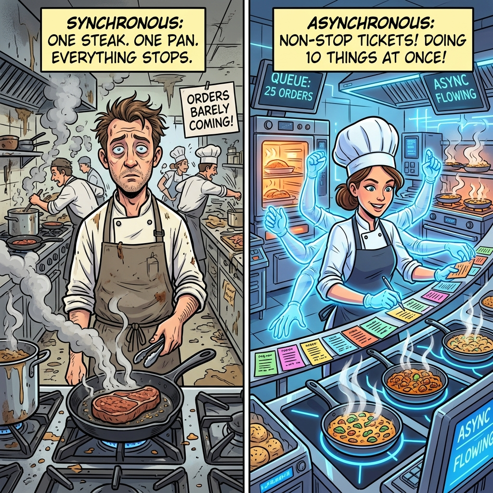

# Part 4e: System Architecture — Asynchronous Dispatch

> *"Almost all of today's high performance ML computations are expressed as long stretches of compiled functions and only occasionally (if ever) branch based on data that is computed by a compiled function."*
> — Appendix B, Pathways paper

---

## The Latency Challenge

This is the section that makes or breaks the entire Pathways architecture. If asynchronous dispatch doesn't work—if the single-controller client can't keep thousands of accelerators fed—then the entire system collapses into the same performance pit that killed TensorFlow v1.

The core challenge is simple to state: **the client is "farther away" from the accelerators than a multi-controller client.**

```
Multi-controller:  Client → PCIe → Accelerator     (1 hop, ~μs)
Pathways:          Client → DCN → Worker → Accelerator  (N hops, ~ms)
```

If every individual dispatch must traverse DCN, the latency penalty is severe. For a computation that takes 10ms on accelerators, adding 1ms of dispatch overhead means **10% loss**. For 0.5ms computations, it's **100%+ loss** — the system spends more time dispatching than computing.

---

## The Solution: Pipeline the Dispatch

The key insight that makes Pathways work is that **ML training is inherently repetitive and predictable**. A typical training loop:

```python
for step in range(1_000_000):
    grads = forward_and_backward(params, next_batch())
    params = update(params, grads)
```

Every iteration calls the **same compiled functions** in the **same order** on the **same devices**. The only thing that changes is the data.

This predictability enables **deep pipelining**: the client can dispatch step N+1, N+2, N+3, … **before step N has finished executing** on the accelerators. The client doesn't need to wait for results — it just fires off computation descriptions and moves on.

```
Time    Client (dispatch)        Accelerators (execution)
  0     Dispatch step 0          
  1     Dispatch step 1          Execute step 0
  2     Dispatch step 2          Execute step 1
  3     Dispatch step 3          Execute step 2
  4     (idle, pipeline full)    Execute step 3
  5     Dispatch step 4          Execute step 4
  ...
```

After the initial pipeline fill (a one-time cost), the accelerators are **never idle**. The dispatch latency is completely hidden.

---

## How It Works Mechanically

### 1. Compiled Function Caching

The first time a JAX function is called with a new input signature, it is **JIT-compiled** to an XLA HLO program and cached. Subsequent calls with the same signature **reuse the cached program**. Since ML training calls the same functions millions of times with the same shapes, compilation is amortized to essentially zero cost after the first few steps.

### 2. Future-Based Data Dependencies

When the client dispatches step N, it doesn't know step N-1's results yet. But it doesn't need to—it passes **futures** (handles to not-yet-computed values) as inputs:

```python
# Step N-1 output is a future, not concrete data
step_n_minus_1_output = pathways.dispatch(train_step, ...)

# Step N takes the future as input — dispatches immediately
step_n_output = pathways.dispatch(train_step, step_n_minus_1_output)

# Step N+1 takes step N's future — also dispatches immediately
step_n_plus_1_output = pathways.dispatch(train_step, step_n_output)
```

The futures are **resolved on the accelerators**, not on the client. When step N-1 completes on TPU, its output tensor stays in HBM and becomes the input for step N — which is already enqueued and waiting.

### 3. Enqueue-Without-Execute

This is the TPU-specific detail that makes deep pipelining possible. TPUs have a **scalar core** that manages a queue of XLA programs. The Pathways worker can **enqueue** a program on the TPU even if the program's input data hasn't arrived yet. The TPU's hardware scheduler will:

1. Check if the input data is available.
2. If yes, execute immediately.
3. If no, **block at the hardware level** until the future resolves.

This means the TPU's execution queue can hold many pending computations, and they execute as soon as their dependencies are satisfied — without any software-level polling or scheduling overhead.

---

## When Does Async Dispatch Break Down?

There's one scenario where pipelining fails: **data-dependent control flow**.

```python
for step in range(1_000_000):
    grads = forward_and_backward(params, next_batch())
    params = update(params, grads)
    
    # THIS breaks pipelining:
    if params.loss < threshold:  # ← requires reading accelerator data
        break
```

The `if` statement requires the client to **read a value from the accelerator back to the host** — a synchronous operation that stalls the pipeline. While the client waits for the loss value to transfer over DCN, no new work is dispatched, and the accelerators may idle.

However, the paper observes that this scenario is **rare** in practice:

> "Almost all of today's high performance ML computations are expressed as long stretches of compiled functions and only occasionally (if ever) branch based on data that is computed by a compiled function."

In practice, data-dependent branching happens at most **once every few hundred or thousand steps** (e.g., early stopping checks, learning rate schedule decisions). The pipelining overhead is amortized over the vast majority of dispatch-only steps.



---

## The Performance Proof

### Single-Island Performance (§5.1, Table 1)

The paper benchmarks Pathways against multi-controller JAX on standard Transformer training across multiple model sizes and TPU configurations:

| Model | TPUs | Multi-Controller | Pathways | Overhead |
|-------|------|----------------:|----------:|---------:|
| 175M  | 8 TPUv3 | 1.00× | ~1.00× | <1% |
| 6.8B  | 64 TPUv3 | 1.00× | ~0.98× | ~2% |
| 6.8B  | 2048 TPUv4 | 1.00× | ~0.98× | ~2% |
| 32B   | 2048 TPUv4 | 1.00× | ~0.98× | ~2% |

The key result: at **2048 TPU v4 chips** — the largest scale tested — Pathways' single-controller overhead is **within 2%** of multi-controller JAX. This is achieved entirely through asynchronous dispatch.

### The 2% Overhead

What is that remaining 2%? The paper identifies two sources:

1. **Dispatch latency during pipeline fill**: The first few steps of training cannot be pipelined (the pipeline is being filled). This is a one-time cost amortized over the entire training run.

2. **Coordination overhead**: The per-island gang-scheduler adds microseconds of latency per computation. For small computations (~0.3ms), this matters; for large computations (~10ms+), it's negligible.

### Cross-Island Performance (§5.3)

For the most demanding benchmark — 64B-parameter Transformer trained data-parallel over **two islands of 512 TPUs each** (1024 total chips), with cross-island gradient synchronization over DCN:

- **Pathways achieves 97.2% throughput** compared to an SPMD configuration using fast ICI communication over the equivalent number of chips.
- The 2.8% overhead is entirely attributable to **DCN transfer latency** — not the coordination or dispatch layer.

---

## Why This Is Architecturally Significant

The success of asynchronous dispatch proves a profound point: **the single-controller vs. multi-controller debate is not about fundamental performance tradeoffs. It's about engineering.**

The conventional wisdom was that single-controller systems are inherently slower because they add network hops. Pathways demonstrates that with careful engineering — futures-based dispatch, compiled function caching, deep pipelining — the network hops can be **completely hidden** behind computation.

This means the ML community doesn't have to choose between flexibility and performance. Pathways demonstrates it's possible to have a **single-controller system** (with all its benefits: resource virtualization, multi-tenancy, MPMD, failure recovery) that matches the **bare-metal speed** of a multi-controller system.

---

*Next up: [Part 4f — Data Management: How Pathways Moves Terabytes Without Breaking a Sweat →](04f_system_architecture_data_management.md)*
