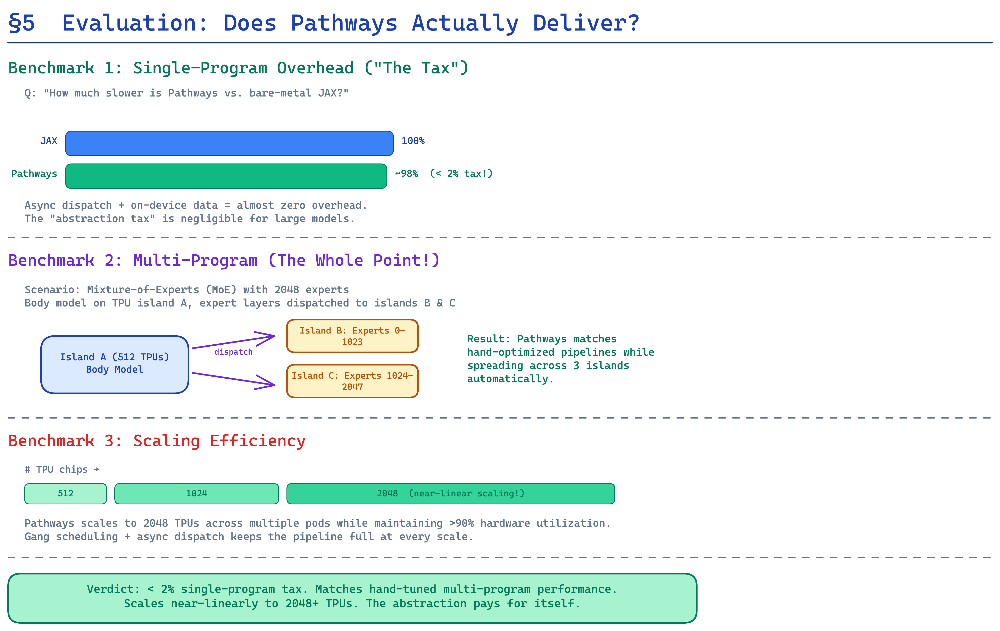

# Part 5: Evaluation — Proving It Works at Scale

> "PATHWAYS achieves near-perfect utilization of 2048 TPU v4 chips..."
> — §5, Pathways paper

---

## Summary

The evaluation section is where the authors prove their architectural claims. They set out to demonstrate that Pathways can match the performance of specialized multi-controller systems while providing the flexibility of a single-controller architecture. They focus on three key scenarios:

1. **Single-island, SPMD** — head-to-head performance against multi-controller JAX (the incumbent).
2. **Multi-tenant, SPMD** — proving gang-scheduling enables efficient hardware sharing.
3. **Cross-island, MPMD** — demonstrating the novel capability that only Pathways offers.

Each experiment is designed to test a different aspect of the system's architecture.

---

## Experiment 1: Single-Island SPMD Performance (§5.1)

### The Question
"Does the single-controller overhead actually matter?"

### Setup
- Standard Transformer language models at three scales: **175M**, **6.8B**, and **32B** parameters.
- Hardware: **8 TPU v3** to **2048 TPU v4** chips.
- Baseline: **Multi-controller JAX** with `jax.pjit` — the fastest production system available.
- Training task: standard next-token prediction on standard corpora.

### Results (Table 1)

| Configuration | Multi-Controller | Pathways | Overhead |
|--------------|----------------:|---------:|---------:|
| 175M, 8 TPUv3 | 1.00× | ~1.00× | <1% |
| 6.8B, 64 TPUv3 | 1.00× | ~0.98× | ~2% |
| 6.8B, 2048 TPUv4 | 1.00× | ~0.98× | ~2% |
| 32B, 2048 TPUv4 | 1.00× | ~0.98× | ~2% |

### Analysis

The critical observation: Pathways' overhead is **constant at ~2%** regardless of scale. Whether you're running on 8 chips or 2048 chips, the single-controller dispatch adds the same small penalty. This proves that **asynchronous dispatch successfully hides the DCN latency** — the pipeline is deep enough at all tested scales.

The remaining 2% comes from:
1. **One-time pipeline fill cost** at the start of training (amortized over millions of steps).
2. **Per-step coordination overhead** in the gang-scheduler (~microseconds per step).
3. **Plaque overhead** for graph management (negligible but non-zero).

At 2048 TPUv4 chips, each chip in a v4 pod has 275 TFLOPS of bfloat16 compute. The total cluster compute is **563 PFLOPS**. Pathways keeps **~98% of this** utilized, losing only ~11 PFLOPS to coordination overhead. For context, the entire GPT-3 training run used ~3.6 PFLOPS for about a month.

### What This Means

This result demolishes the assumption that single-controller systems are inherently slower. The architectural flexibility of Pathways (resource virtualization, multi-tenancy, MPMD) comes at **essentially zero performance cost** for standard SPMD workloads.

---

## Experiment 2: Multi-Tenant SPMD (§5.2)

### The Question
"Can multiple programs efficiently share the same accelerators?"

### Setup
- **8 TPU v3 chips** running a synthetic workload.
- Each program computes for only **0.33ms** — deliberately small to stress the scheduling system.
- 1, 4, 8, and 16 concurrent clients submit programs simultaneously.

### Results (Figure 8)

| Clients | Device Utilization | Program Scheduling |
|---------|-------------------:|-------------------:|
| 1 | Low (~40%) | Large gaps between programs |
| 4 | Moderate (~70%) | Visible interleaving |
| 8 | High (~90%) | Dense interleaving |
| 16 | Near-complete (~100%) | Seamless interleaving |

### Analysis

With a single client, the 0.33ms compute time is too small relative to the dispatch overhead — accelerators sit idle between programs. The dispatch overhead includes:
- Client → Plaque RPC transmission.
- Gang-scheduling decision.
- XLA program enqueue on each TPU.

With 16 clients submitting programs concurrently, the gang-scheduler **interleaves** them at sub-millisecond granularity. While one program's dispatch is in flight, another program's computation is executing. The result is near-100% utilization.

### Workload Traces (Appendix D, Figure 11)

The paper includes actual TPU core traces showing the interleaving:

- **1 client**: Visible gaps between program executions. Each 0.33ms computation is followed by idle time while the next dispatch traverses DCN.
- **4 clients**: Gaps shrink. Programs from different clients fill each other's idle slots.
- **8 clients**: Gaps are nearly eliminated. The pipeline is consistently full.
- **16 clients**: Essentially no visible gaps. Programs are densely packed across all cores.

### What This Means

This is the experiment that validates Pathways' core value proposition for infrastructure operators. Instead of giving each researcher their own exclusive TPU pod (and accepting 10-40% utilization), operators can **pack multiple workloads onto the same hardware** with near-zero performance loss.

For a 2048-TPU pod costing millions of dollars, improving utilization from 40% to 100% represents **millions of dollars in annual savings** — without any change to the researchers' code.

---

## Experiment 3: Cross-Island MPMD (§5.3)

### The Question
"Can Pathways efficiently coordinate computation across multiple TPU islands connected by DCN?"

### Setup
- **64B-parameter Decoder-only Transformer** (comparable to a mid-size GPT-3 variant).
- **Two islands of 512 TPU v4 chips** (1024 total), connected via DCN.
- Training strategy: **data-parallel** — each island computes gradients on its local data, then islands exchange gradients via DCN for synchronization.
- Baseline: **Single-island SPMD** using 1024 chips on a single ICI mesh.

### Results (Figure 10)

| Configuration | Throughput | vs. Single-Island Baseline |
|--------------|----------:|---------------------------:|
| Single island, 1024 TPUv4 (SPMD) | 1.00× | Baseline |
| Two islands × 512 TPUv4 (Pathways MPMD) | 0.972× | **97.2%** |

### Analysis: Where Does the 2.8% Go?

The 2.8% overhead comes from one source: **DCN transfer latency** for exchanging gradients between islands.

The transfer protocol:
1. Each island computes local gradients (~90% of step time).
2. Gradients are gathered via ICI to DCN-connected hosts (<1% of step time).
3. Hosts transfer gradients over DCN (~2.5% of step time).
4. Gradients are scattered via ICI to destination TPUs (<1% of step time).
5. Each island applies the combined gradients (~5% of step time).

Critically, step 1 of iteration N+1 **overlaps** with steps 2–4 of iteration N. But DCN bandwidth (slower than ICI) creates a small pipeline bubble — this accounts for the 2.8%.

### The Trace Profile (Figure 12)

The paper includes a detailed trace of the cross-island training:
- The first eight rows (blue) show TPU computations on a host in Island 1.
- The next eight rows (green) show TPU computations on a host in Island 2.
- The trace clearly shows the **tight interleaving** of computation and transfer — the DCN transfer occupies a small gap between compute phases.

### What This Means

97.2% throughput across two islands is a **remarkable result**. For context:

- **Without Pathways**: To train this model, you'd need a single 1024-chip island with a high-speed ICI mesh. These are incredibly expensive and scarce resources.
- **With Pathways**: You can use **two smaller 512-chip islands** (more commonly available) and lose only 2.8% of throughput. This dramatically improves hardware accessibility and scheduling flexibility.

More importantly, this is a **novel capability** — no previous system demonstrated efficient MPMD training across multiple TPU islands at this scale. It's the proof that Pathways' architecture actually enables computations that were previously impossible.

---

## Summary of Key Numbers

| Metric | Value | Significance |
|--------|------:|-------------|
| Single-island overhead vs. multi-controller | ~2% | Single-controller is viable |
| Multi-tenant utilization (16 clients) | ~100% | Gang-scheduling works |
| Cross-island throughput | 97.2% | MPMD is practical |
| Largest scale tested | 2048 TPUv4 | Production-grade |
| Model sizes tested | 175M → 64B | Covers practical range |

---

*Next up: [Part 6 — Related Work & Future Directions: Where Is This Going? →](06_related_work_and_future_directions.md)*
