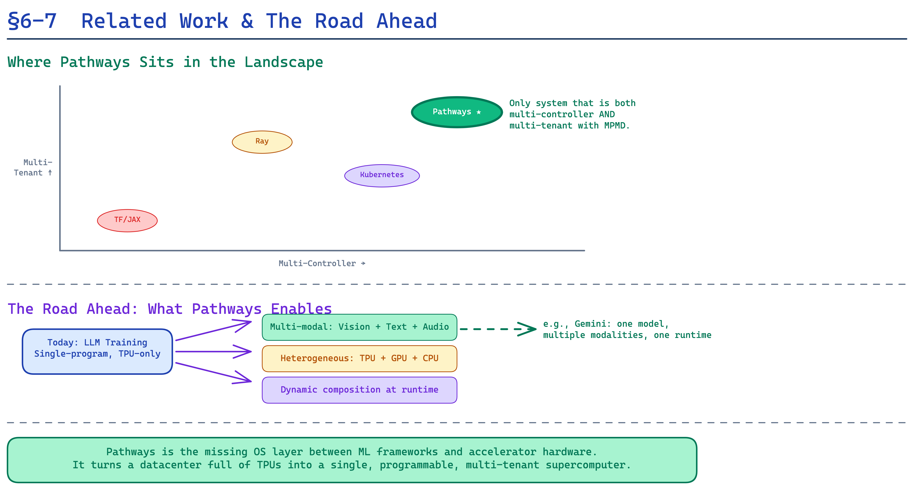

# Part 6: Related Work & Future Directions

> *"Our ambition is that Pathways will be to TPU pods as an operating system is to a general-purpose computer."*
> — §7, Pathways paper

---

## Related Work: Standing on the Shoulders of Systems

Pathways doesn't exist in a vacuum. It synthesizes decades of ideas from **distributed systems**, **HPC**, **dataflow engines**, and **ML frameworks**. Understanding the related work contextualizes *what* is truly novel about Pathways and *why* existing systems were insufficient.

### ML Frameworks: The First Generation

**TensorFlow (Abadi et al., 2016)** pioneered the concept of a distributed dataflow graph for ML. Its `tf.Session.run()` API was essentially a single-controller model — the user builds a graph, sends it to a distributed runtime, and gets results back. But TF v1 suffered from the three problems Pathways solves: high dispatch latency, no gang-scheduling, and O(N²) graph explosion.

**PyTorch (Paszke et al., 2019)** took the opposite approach with eager execution — the user's Python code directly dispatches operations to local accelerators. This is effectively a multi-controller model (on a single host). PyTorch DDP (Distributed Data Parallel) extends this to multiple hosts, but retains the SPMD-only limitation.

**JAX (Bradbury et al., 2018)** found a middle ground: eager Python semantics for debugging combined with `jit` and `pjit` for high-performance compiled execution. But before Pathways, JAX was also limited to multi-controller SPMD.

### Distributed Schedulers

**Borg (Verma et al., 2015)** — Google's cluster management system — schedules long-running jobs across thousands of machines. Pathways' resource manager is conceptually similar to Borg, but operates at a very different timescale: Borg schedules jobs over **seconds to hours**; Pathways schedules computations over **microseconds to milliseconds**.

**Gandiva (Xiao et al., 2018)** and **Tiresias (Gu et al., 2019)** introduced introspective GPU cluster scheduling, including time-multiplexing GPUs across ML jobs. Pathways extends this concept to **millisecond-scale** gang-scheduling across thousands of accelerators.

### Model Parallelism Systems

**GPipe (Huang et al., 2019)** introduced micro-batch pipelining for model parallelism — splitting a model into stages and interleaving micro-batches to fill pipeline bubbles. GPipe operates within SPMD; Pathways' MPMD support makes pipeline parallelism a **native** capability.

**Megatron-LM (Shoeybi et al., 2019)** demonstrated efficient tensor-parallel + pipeline-parallel training for large Transformers. Megatron achieves excellent performance but requires **manual model partitioning** and is tightly coupled to NVIDIA's NCCL library. Pathways automates this through the resource manager and compiler.

**DeepSpeed ZeRO (Rajbhandari et al., 2020)** and **FSDP (Zhao et al., 2023)** focus on memory-efficient data parallelism through parameter sharding. These are complementary to Pathways — they could run *within* Pathways as compiled functions.

### Dataflow Systems

**Naiad (Murray et al., 2013)** introduced timely dataflow with fine-grained progress tracking. Plaque shares Naiad's philosophy of **precise dependency tracking** but applies it to accelerator computations rather than general-purpose data processing.

**Ray (Moritz et al., 2018)** provides a general actor-based distributed computing framework used for ML training (via RLlib, Tune, etc.). Ray's flexibility comes from a different design point — general-purpose task scheduling with remote objects — whereas Pathways is specifically optimized for the characteristics of accelerator-bound ML computations.

---

## Future Directions: What Pathways Enables

The paper's §7 outlines six concrete future directions that Pathways' architecture uniquely enables. These aren't speculative — they're engineering problems that become tractable specifically because of Pathways' design choices.

### 1. Multi-Tenancy at Scale

**The vision:** Instead of allocating exclusive TPU pods to individual researchers, an organization runs a **shared Pathways cluster** where dozens of workloads coexist on the same hardware.

**Why Pathways enables it:** The gang-scheduler and resource manager already support millisecond-scale time-multiplexing. Scaling this to thousands of concurrent users requires solving:
- **Fair scheduling policies** (beyond FIFO).
- **Isolation guarantees** (ensuring one user's workload doesn't interfere with another's).
- **Priority systems** (production training > experimental runs > interactive development).

### 2. Elastic and Resilient Training

**The vision:** Training runs that **automatically adapt** to cluster conditions — scaling up when more hardware becomes available, scaling down gracefully when hardware fails or is reclaimed for higher-priority workloads.

**Why Pathways enables it:** The virtual device abstraction already decouples user code from physical hardware. Elastic training requires:
- **Live migration** of virtual devices from one physical device to another.
- **Checkpoint-free recovery** where the runtime remaps failed devices and re-enqueues lost computations.
- **Dynamic resharding** where the model's sharding strategy adapts to the number of available devices.

### 3. Heterogeneous Hardware

**The vision:** A single computation graph that spans **different types** of accelerators — e.g., using TPU v4 for dense matrix operations and TPU v5 for sparse operations, or mixing GPUs and TPUs.

**Why Pathways enables it:** The resource manager already abstracts device types behind virtual devices. Adding heterogeneous support requires:
- **Cross-compilation** — generating different XLA programs for different accelerator types.
- **Performance modeling** — the scheduler needs to know expected execution times on each device type.
- **Data format conversion** — different accelerators may use different memory layouts.

### 4. Mixture of Experts at Unprecedented Scale

**The vision:** MoE models with **thousands of experts** distributed across an entire datacenter, with tokens dynamically routed to the right expert based on content.

**Why Pathways enables it:** Unlike SPMD systems (where MoE requires all-to-all communication), Pathways can:
- **Place each expert on its own device group** using the resource manager.
- **Route tokens dynamically** through Plaque's dataflow graph.
- **Gang-schedule expert computations** to avoid deadlocks.
- **Load-balance** by monitoring expert utilization and redistributing traffic.

### 5. Pipeline Parallelism Without the Hacks

**The vision:** Pipeline parallelism as a **first-class feature**, not a hack layered on top of SPMD.

**Why Pathways enables it:** MPMD is native to Pathways. Each pipeline stage is a different compiled function running on a different device group. The system handles:
- **Micro-batch scheduling** to fill pipeline bubbles.
- **Automatic data transfers** between stages (via Plaque transfer operators).
- **Dynamic pipeline depth** — adding or removing stages based on available hardware.

### 6. The "Operating System for ML"

The paper's most ambitious claim:

> "Our ambition is that Pathways will be to TPU pods as an operating system is to a general-purpose computer."

Just as an operating system provides:
- **Process isolation** → Pathways provides workload isolation via virtual devices.
- **Virtual memory** → Pathways provides virtual devices that abstract physical hardware.
- **Scheduling** → Pathways provides gang-scheduling with pluggable policies.
- **IPC** → Pathways provides efficient cross-program data sharing through Plaque.

---

## The Broader Impact

Pathways represents a **paradigm shift** that extends beyond Google's infrastructure. The key insights — asynchronous single-controller dispatch, sharded dataflow coordination, futures-based execution, and centralized gang-scheduling — are applicable to **any** large-scale ML system.

The ML infrastructure landscape in 2024-2025 shows Pathways' influence:
- **TPU v5e and v5p** are designed with Pathways-style multi-tenancy in mind.
- **Gemini** models (including the multimodal Gemini Ultra) were trained on Pathways infrastructure.
- Open-source frameworks are increasingly adopting single-controller-inspired designs with JAX-based ecosystems like **Orbax** for checkpointing and **Grain** for data loading.

The most profound implication is economic: by making it possible to efficiently **share** expensive accelerator clusters across many workloads, Pathways fundamentally changes the cost equation for AI research. The era of exclusive, inefficient hardware allocations is ending. The era of intelligent, shared infrastructure is beginning.

---

*Next up: [Part 7 — Appendices: The Hardware Deep-Dive →](07_appendices.md)*
